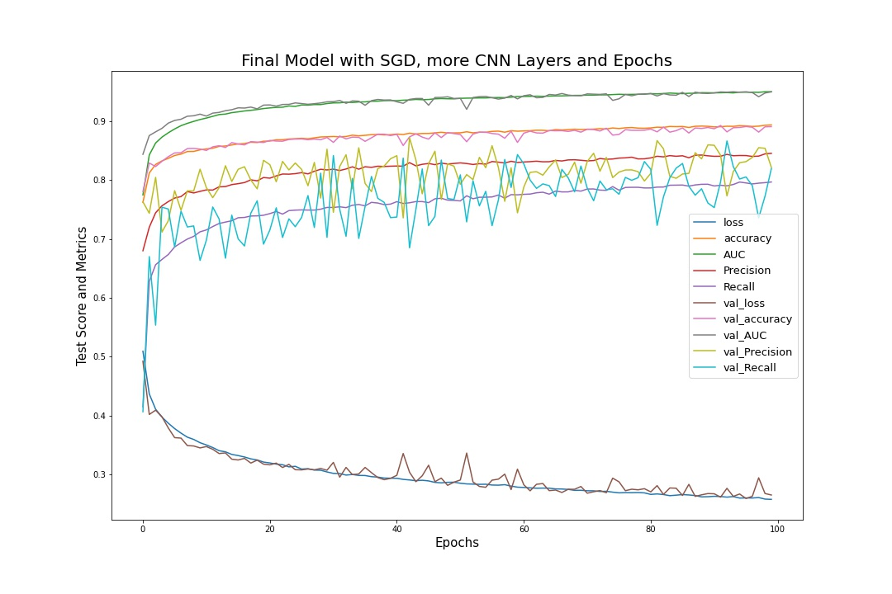

# **Breast Histopathology Images Prediction**

## **Background**

Breast cancer is a serious global health problem. Early detection is one of the key determinants for treatment and survival. For people diagnosed with breast cancer, evaluating the aggressiveness grade is critical. It is used to help predict your outcome and to help figure out what treatments might work best. Breast histopathology imaging is one of the techniques used for this purpose. Basically it is to collect tissue samples from the patient and scan 40x enlarged images for every patch of the sample using some kind of special microscope. Some patches are cancerous, some are not. The aggressiveness grade will be largely dependent on the number, size, and location of these cancerous patches. 

The dataset consist of 277,524 images from 279 patients who were diagnosed with breast cancer. I selected images from 100 patients which reduce the image numbers to about 100,000. 

**Data Source: [https://www.kaggle.com/paultimothymooney/breast-histopathology-images](https://www.kaggle.com/paultimothymooney/breast-histopathology-images)**
 

## **Objective**

Build an Convolutional Neural Network model to classify if an image shows cancerous symptoms or not, which will in turn assist in determing the cancer stage.

## **EDA**

### **The Data Structure**

The images are split into train, validation, and test datasets (60% : 20% : 20%). Each folder contains two sub-folders corresponding to cancerou (class 1) and non-cancerous (class 0).

### **Sample Images for Each Class**

**
Sample images for Class 1 Cancerous
**

**
Sample images for Class 0 Non-Cancerous
**

### **Class Balance**

The ratio of Class 0 to Class 1 is about 2:1, it is an unbalanced dataset. However, since I have huge amount of images, it's unlikely that any of the two  classes will be under represented in any of the train, validation, and test datasets. So I will still use accuracy as the measurement metric, along with some other metrics. 

## **CNN Model**

### **Data Augmentation with ImageDataGenerator**

* rescale=1./255
* shear_range=0.2
* zoom_range=0.2
* rotation_range=90
* horizontal_flip=True
* vertical_flip = True
* width_shift_range = 0.2
* height_shift_range = 0.2

### **Base CNN Model**

* CNN layers: 3
* Activation function: relu for speed, sigmoid for last output layer
* Optimizer: adam
* Loss function: binary_crossentropy
* Metrics: accuracy, AUC, Precision, Recall
* Parameters: 94,305
* Epochs: 50
* Result: 
    * Loss: 0.320
    * Accuracy: 0.863
    * AUC: 0.933
    * Precision: 0.872
    * Recall: 0.648
    * F1_score: 0.834

### **Fine-Tuning the Model**

Scores and Metrics | Base | Softmax | SGD | Batch Normalization | L2 Regularization | lr 0.01 | lr 0.0005 | lr 0.0001
------------ | ------------- | ------------- | ------------- | ------------- | ------------- | ------------- | ------------- | ------------- 
Loss | 0.320 | 10.60 | 0.312 | 0.379 | 0.391 | 0.410 | 0.326 | 0.327
Accuracy | 0.863 | 0.305 | 0.868 | 0.856 | 0.846 | 0.826 | 0.858 | 0.858
AUC | 0.933 | 0.5 | 0.927 | 0.908 | 0.898 | 0.869 | 0.929 | 0.923
Precision | 0.872 | 0.305 | 0.806 | 0.795 | 0.760 | 0.742 | 0.757 | 0.804 | 
Recall | 0.648 | 1.0 | 0.746 | 0.712 | 0.722 | 0.660 | 0.808 | 0.726 |

### **Final Model**

**Changes made to the base model:**

* SGD instead of Adam as optimizer
* Three more CNN layers
* Parameters: 202,945

Metrics | Base Model | Final Model | HoldOut
------------ | ------------- | ------------- | -------------
Loss | 0.320 | 0.265 | 0.261
Accuracy | 0.863 | 0.890 | 0.895
AUC  | 0.933 | 0.949 | 0.950
Precision | 0.872 | 0.821 | 0.833
Recall | 0.648 | 0.819 | 0.822
F1_score  | 0.834 | 0.871 | 0.876

## Summary

A Convolutional Neural Network model is built to classify patient breast tissue scan images as either cancerous or non-cancerous. Hyperparameters are fine-tuned to improve the model. The final model achieves an accuracy of 0.886 for holdout dataset.

## Future Plans

* Try to fine-tune learning rate for SGD optimizer, and try out more epochs as I even didn't reach 100 epochs due to technical problems.
* Try out Hyperas module to sysmatically fine-tune the hyperparameters of the models. I tried it for this project, but didn't get it work.
* Try out AlexNet, ResNet, VGGNet, and Inceptionet to have an idea how these neural networks differ from each other and CNN.

(Please see jupyter notebooks for codes and details)
